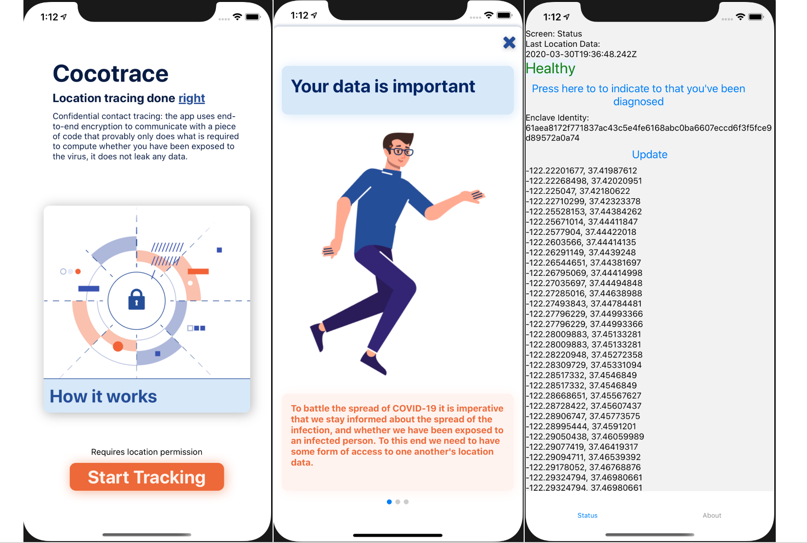

# 🥥 cocotrace | Confidential Contact Tracing

This is the repo for the *cocotrace* project in the CodeVsCovid19 Hackathon. 

https://devpost.com/software/cocotrace-confidential-contact-tracing

https://www.codevscovid19.org

Most members of this team are from [decentriq](https://www.decentriq.ch).

## The Problem

Contact tracing has helped drastically flatten the curve in countries such as South Korea. However, tracing requires tracking people's movements. This raises legitimate privacy concerns.

## The Solution

At decentriq ([www.decentriq.ch](http://www.decentriq.ch/)) we work with privacy preserving technologies. We believe that you can have both, contact tracing and data privacy.

We've built a confidential contact tracing system, including an iOS app and a confidential computing server.

Intel SGX technology allows the server to prove its program logic to the app before the app sends data to the server. In particular the server can prove that it cannot leak the user's data.

## 🥥 cocotrace | Confidential Contact Tracing

The cocotrace system uses a central confidential computing server. The server proves its identity to the apps in the form of a signed hash of its code. Additionally, it prevents memory-attacks through memory encryption and isolation.

cocotrace minimizes the privacy risk through provable data confidentiality.

For the server we use Rust and an SGX-embedded webserver depoyed on an Azure Confidential Compute instance. The app was built in react-native.

### Screenshots



## Traditional Systems

Contact tracing systems which are currently in use come with privacy problems. In central approaches all data could potentially be accessed by the authorities. In "edge approaches" infected people's data are exposed. Israel's Hamagen system is such a case, for a detailed comparison see "Comparison with Hamagen" below.

### Comparison to Hamagen

Israel's health ministery recently launched [Hamagen](https://[https://play.google.com/store/apps/details?id=com.hamagen](https://play.google.com/store/apps/details?id=com.hamagen)
), a contact tracing system. The Hamagen app claims that it only processes the user's location data on device. Which is a good first step, however, it fetches the traces of relevant infected people from public government servers. Hence, the location data of infected patients is not protected at all but instead gets pushed to all other users in order to compute locally if they had been close to the infected person. 

Hamagen protects the data privacy of the healthy people and is a clear improvement over a central server collecting all data on an ongoing basis. It however requires the infected people to share all their  movement data with all people in the system. This sharing is likely to prevent some people from revealing their infection.

In terms of privacy, the *cocotrace* system is superior to Hamagen as *cocotrace* protects the privacy of all participants. The only information getting out about you is the fact that you have met one of patients. If we generalise the returned timestamp to only reveal the day when this happened, we argue that *cocotrace* also protects the privacy of infected people really well. 

In *cocotrace* there is nothing preventing people from letting the system know that they have been infected. This improved privacy should bring more users to the system and improve the crucial contact tracing success rate. 


## 🛠️ Build and install


### Backend

#### Requirements

- Linux
- SGX-capable and SGX-enabled machine (see BIOS settings for enabling it)
- nix
- Docker or NixOS

#### Install SGX driver and aesmd

##### NixOS
If for some reason you're running NixOS, first off, high-five! Second, there's an SGX module in `nix/modules/intel.nix`, and a systemd daemon in `nix/packages/intel-aesmd`. To install add the following to your configuration:
```
  imports = [
    path/to/nix/modules/intel.nix
  ]
  (...)
  hardware.cpu.intel.sgx.enable = true;
  hardware.cpu.intel.aesmd.enable = true;
  hardware.cpu.intel.aesmd.package = callPackage path/to/nix/packages/intel-aesmd/2.7.0.nix {};
  (...)
```

Then rebuild your config.

##### Other Linux OS

The driver must be built from source:
```
git clone git@github.com:intel/linux-sgx-driver.git
cd linux-sgx-driver
git checkout sgx2   # Important
sudo make install   # Need root because it's a kernel module
sudo modprobe isgx  # Load module (taints kernel)
lsmod | grep isgx   # Double check it's running
dmesg | tail        # Check kernel logs if something's off, most probably SGX isn't enabled in BIOS
```

The aesmd daemon must be running:
```
docker run --detach --restart always --device /dev/isgx --volume /var/run/aesmd:/var/run/aesmd --name aesmd fortanix/aesmd:2.7.101.3
```
Note that `/dev/isgx` is forwarded, which is only present if the driver loaded successfully.

#### Build and run enclave
```
./nix-shell
cd backend
cargo run # Builds enclave and uses ftxsgx-runner-cargo to load it
```

The enclave will bind `[::]:3000`

### Mobile App
Currently MacOS as a build machine and iOS as a target is supported. Linux/Windows as well as Android is currently not supported.

#### Requirements

- `node.js`
- `yarn`
- `cocoapods`
- `Xcode` (only for iOS)

#### iOS

- Install dependencies

    ```
    yarn
    cd ios && pod install && cd ..
    ```   

- Start React Native server 

    ```
    yarn run ios
    ```

#### Android

TBD

## Security
cocotrace is currently considered prototype software. Do **not** deploy it in production, or trust it with sensitive data.

The main pieces missing for production use are full remote attestation and a production-signed enclave:

### Remote attestation
Remote attestation is the process of establishing trust in a running instance of an enclave. During loading of an enclave the SGX-capable CPU will hash the binary, and will later on sign this hash using a CPU-specific key. This signature must be later sent to Intel which will verify the signature and provide their own signature, which the end user application can check.

Currently this project does **not** do this roundtrip to Intel, the CPU-signed datastructure is returned directly to the user app. This is due to time constraints, as well as the fact that the roundtrip to Intel requires an auth token.

### DEBUG enclave
Furthermore, the enclave is currently loaded in a DEBUG-mode, which allows a debugger to attach to the enclave, allowing it to read enclave memory. Disabling DEBUG-mode requires a production signature over the enclave's hash, from a key that's specifically whitelisted by Intel. Again, due to time constraints as well as not wanting to sign a non-production-ready enclave, we have omitted this for the sake of the hackathon.

## License

Rust is primarily distributed under the terms of both the MIT license
and the Apache License (Version 2.0), with portions covered by various
BSD-like licenses.

See [LICENSE-APACHE](LICENSE-APACHE) and [LICENSE-MIT](LICENSE-MIT) for details.
